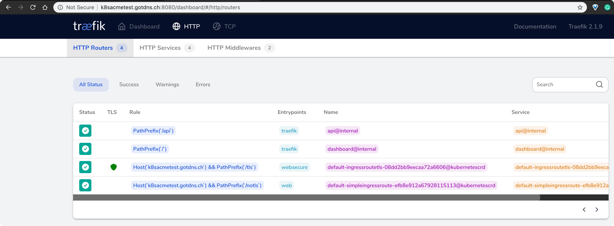
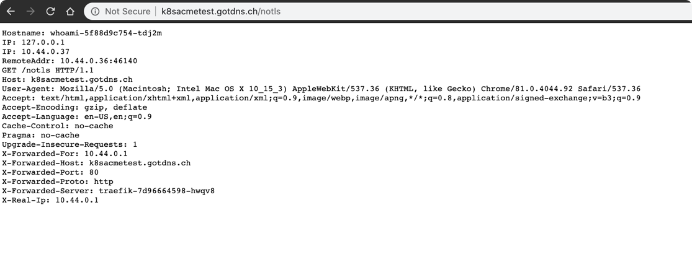
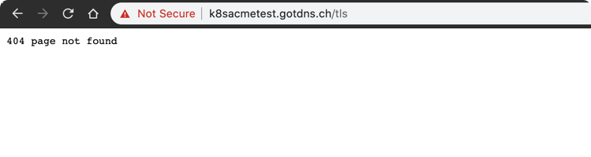
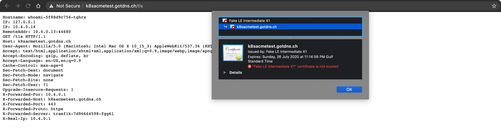

## To deploy traefik on GKE with whoami service and get certificate using lets encrypt


- Run the following command and create all the resource objects except ingress-route

```bash
$ kubectl apply -f 00-resource-crd-definition.yml,05-traefik-rbac.yml,10-service-account.yaml,15-traefik-deployment.yaml,20-traefik-service.yaml,25-whoami-deployment.yaml,30-whoami-service.yaml
customresourcedefinition.apiextensions.k8s.io/ingressroutes.traefik.containo.us created
customresourcedefinition.apiextensions.k8s.io/middlewares.traefik.containo.us created
customresourcedefinition.apiextensions.k8s.io/ingressroutetcps.traefik.containo.us created
customresourcedefinition.apiextensions.k8s.io/tlsoptions.traefik.containo.us created
customresourcedefinition.apiextensions.k8s.io/traefikservices.traefik.containo.us created
clusterrole.rbac.authorization.k8s.io/traefik-ingress-controller created
clusterrolebinding.rbac.authorization.k8s.io/traefik-ingress-controller created
serviceaccount/traefik-ingress-controller created
deployment.apps/traefik created
service/traefik created
deployment.apps/whoami created
service/whoami created
```

- Get the IP of the Traefik Service exposed as Load Balancer
```bash
$ kubectl get service
NAME         TYPE           CLUSTER-IP      EXTERNAL-IP    PORT(S)                                     AGE
kubernetes   ClusterIP      10.109.0.1      <none>         443/TCP                                     6h16m
traefik      LoadBalancer   10.109.15.230   34.69.16.102   80:32318/TCP,443:32634/TCP,8080:32741/TCP   70s
whoami       ClusterIP      10.109.14.91    <none>         80/TCP                                      70s
```


- Create a DNS record for this IP
```bash
$ nslookup k8stestacmetls.gotdns.ch
Server:         192.168.1.1
Address:        192.168.1.1#53

Non-authoritative answer:
Name:   k8stestacmetls.gotdns.ch
Address: 34.69.16.102
```

- Create the resource ingress-route
```bash
$ kubectl apply -f 35-ingress-route.yaml
ingressroute.traefik.containo.us/simpleingressroute created
ingressroute.traefik.containo.us/ingressroutetls created
```

- Logs of traefik
```bash
time="2020-04-25T20:10:31Z" level=info msg="Configuration loaded from flags."
time="2020-04-25T20:10:32Z" level=error msg="subset not found for default/whoami" providerName=kubernetescrd ingress=simpleingressroute namespace=default
time="2020-04-25T20:10:32Z" level=error msg="subset not found for default/whoami" providerName=kubernetescrd ingress=ingressroutetls namespace=default
time="2020-04-25T20:10:52Z" level=error msg="Unable to obtain ACME certificate for domains \"k8stestacmetls.gotdns.ch\": unable to generate a certificate for the domains [k8stestacmetls.gotdns.ch]: acme: Error -> One or more domains had a problem:\n[k8stestacmetls.gotdns.ch] acme: error: 400 :: urn:ietf:params:acme:error:connection :: Timeout during connect (likely firewall problem), url: \n" routerName=default-ingressroutetls-08dd2bb9eecaa72a6606@kubernetescrd rule="Host(`k8stestacmetls.gotdns.ch`) && PathPrefix(`/tls`)" providerName=default.acme
```


- Results Acheived
    - Dashboard


    - Whoami Service with notls



## Unable to achieve
- Whoami service with tls generated by ACME let's encrypt



- ACME certificate after making the relevent changes


    
