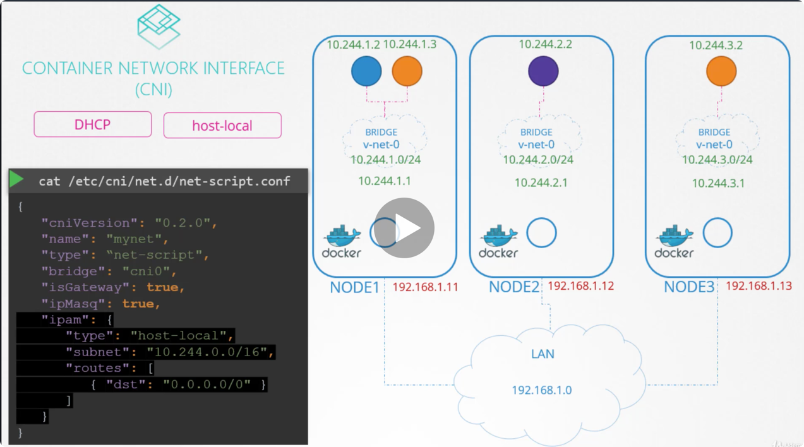

### How are the virtual bridge networks between the nodes assigned the subnet and how are the pods assigned an IP

CNI says it is the responsibility of the CNI plug in the network solution provider to take care of assigning IP to the containers.

To ensure no dublicate IPs 

An easy way to do it is to store the list of IPs in a file and make sure we have necessary code in
our script to manage this file properly.


CNI comes with two built in plugins to which you can outsource this task
to. In this case the plugin that implements the approach that we followed for managing the IP addresses
locally on each host is the host-local plugin but it's still our responsibility to invoke that plugin
in our script or we can make our script dynamic to support different kinds of plugins.


The CNI configuration file has a section called APM in which we can specify the type of plug in to be
used the subnet and route to be used.




### What is the Networking Solution used by this cluster?
    
```bash
ls /etc/cni/net.d/
10-weave.conflist
```

### How many weave agents/peers are deployed in this cluster?
    
```bash
$ kubectl get pods -n kube-system | grep weave
weave-net-8w8wh                        2/2     Running   0          7m28s
weave-net-hdvx4                        2/2     Running   1          7m28s
weave-net-kdzpm                        2/2     Running   1          7m28s
weave-net-t9qsv                        2/2     Running   1          7m28s
```

### On which nodes are the weave peers present?
    
```bash
$ kubectl get pods -n kube-system -o wide | grep weave
weave-net-8w8wh                        2/2     Running   0          8m27s   172.17.0.20   controlplane   <none>           <none>
weave-net-hdvx4                        2/2     Running   1          8m27s   172.17.0.45   node02         <none>           <none>
weave-net-kdzpm                        2/2     Running   1          8m27s   172.17.0.46   node03         <none>           <none>
weave-net-t9qsv                        2/2     Running   1          8m27s   172.17.0.43   node01         <none>           <none>
```


### Identify the name of the bridge network/interface created by weave on each node

```bash
$ ip link
1: lo: <LOOPBACK,UP,LOWER_UP> mtu 65536 qdisc noqueue state UNKNOWN mode DEFAULT group default qlen 1000
    link/loopback 00:00:00:00:00:00 brd 00:00:00:00:00:00
2: ens3: <BROADCAST,MULTICAST,UP,LOWER_UP> mtu 1500 qdisc fq_codel state UP mode DEFAULT group default qlen 1000
    link/ether 02:42:ac:11:00:14 brd ff:ff:ff:ff:ff:ff
3: docker0: <NO-CARRIER,BROADCAST,MULTICAST,UP> mtu 1500 qdisc noqueue state DOWN mode DEFAULT group default 
    link/ether 02:42:9c:e6:af:ac brd ff:ff:ff:ff:ff:ff
7: datapath: <BROADCAST,MULTICAST,UP,LOWER_UP> mtu 1376 qdisc noqueue state UNKNOWN mode DEFAULT group default qlen 1000
    link/ether 4e:e2:ba:58:61:ea brd ff:ff:ff:ff:ff:ff
9: weave: <BROADCAST,MULTICAST,UP,LOWER_UP> mtu 1376 qdisc noqueue state UP mode DEFAULT group default qlen 1000
    link/ether 2a:77:e6:0a:61:29 brd ff:ff:ff:ff:ff:ff
11: vethwe-datapath@vethwe-bridge: <BROADCAST,MULTICAST,UP,LOWER_UP> mtu 1376 qdisc noqueue master datapath state UP mode DEFAULT group default 
    link/ether 46:cb:5d:43:3b:cf brd ff:ff:ff:ff:ff:ff
12: vethwe-bridge@vethwe-datapath: <BROADCAST,MULTICAST,UP,LOWER_UP> mtu 1376 qdisc noqueue master weave state UP mode DEFAULT group default 
    link/ether 32:af:ee:8e:65:a1 brd ff:ff:ff:ff:ff:ff
13: vxlan-6784: <BROADCAST,MULTICAST,UP,LOWER_UP> mtu 65535 qdisc noqueue master datapath state UNKNOWN mode DEFAULT group default qlen 1000
    link/ether 62:ec:f3:e5:1a:7e brd ff:ff:ff:ff:ff:ff
controlplane $ 
```


### What is the POD IP address range configured by weave?
    
```bash
controlplane $ ip addr show weave
9: weave: <BROADCAST,MULTICAST,UP,LOWER_UP> mtu 1376 qdisc noqueue state UP group default qlen 1000
    link/ether 2a:77:e6:0a:61:29 brd ff:ff:ff:ff:ff:ff
    inet 10.46.0.0/12 brd 10.47.255.255 scope global weave
       valid_lft forever preferred_lft forever
    inet6 fe80::2877:e6ff:fe0a:6129/64 scope link 
       valid_lft forever preferred_lft forever
```


### What is the default gateway configured on the PODs scheduled on node03?

- Try scheduling a pod on node03 and check ip route output    

```bash
$ kubectl run busybox --image=nginx --dry-run=client -o yaml > pod.yaml
$ cat pod.yaml | grep -A 2 -i nodename
  nodeName: node03
  containers:
  - image: nginx
$ kubectl exec -it busybox -- sh
# ip -r
```